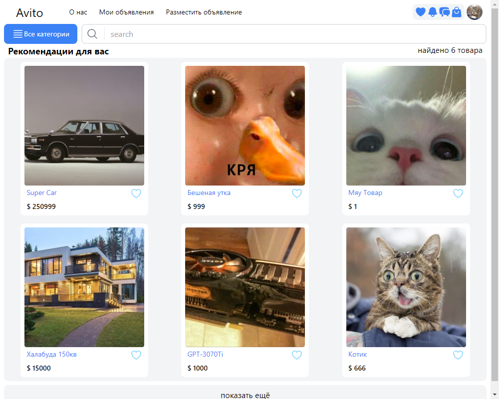
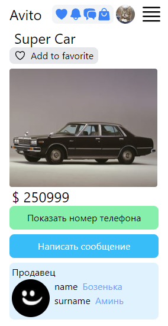
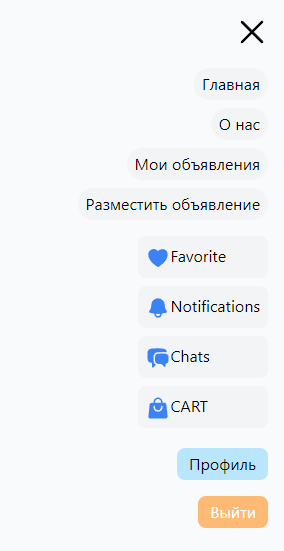
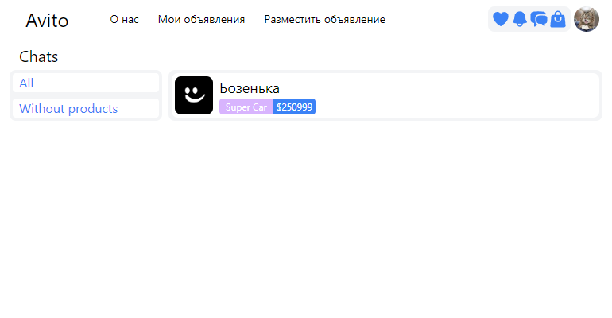
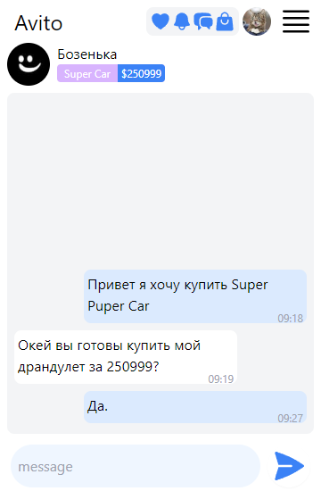
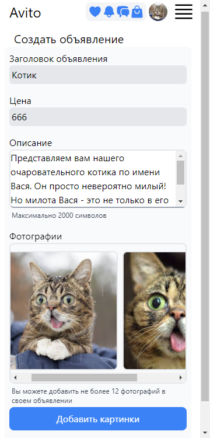

# ECommerce Avito

This pet project was created to demonstrate my capabilities in creating a web application using NextJS, Prisma.ORM with (PostgreSQL), Socket.IO and others.


[Messages Server: pet6_ecommerce_avito](https://github.com/StarchenkoDmitry/pet6_ecommerce_avito_server)


**Table of Contents**

[Capabilities](#capabilities)
[Getting Started](#Getting-Started)
[List of technologies used](#List-of-technologies-used)
[Notes](#notes)
[Ссылки](#Ссылки)


#### Capabilities


1. Home page - displays products on the site. It also has the ability to search by product name.



2. Product page - this is a mobile version of the page, on it you can see the main information of the product, or write a message to the seller, and also find out the seller’s number so that you can discuss the details of the product.



3. Burger menu - yum yum.



4. Page with your chats.



5. Chat page - on it you can chat with the seller about the product or just because you like the person.



5. Product announcement page - on it you can give the product name, price, description and add several photos.



сreateitem_page


#### List of technologies used
- Next.JS
- Prisma.ORM (PostgreSQL)
- Socket.IO - for online chat
- Sharp - library for working with pictures(changes scale, cropping pictures)
- Next-Auth - for authorization by using JWT(note: in this project I used JWT as DataBase strategy.)
- Heroicons - the title says it all


#### Getting Started

1. Install the packages first
```bash
npm install
```


###### ***Start the project in development mode***
1. Run this script
```bash
npm run dev
```


###### ***Building project and start product***
1. Run this script
```bash
npm run build
```
2. Run Product Mode
```bash
npm run start
```


#### Notes

1. Next-Auth - in this project I used JWT as a DataBase strategy to understand how JWT works in next-auth.

2. For chats to work, you need a message server, it is located in another repository. [Messages Server: pet6_ecommerce_avito](https://github.com/StarchenkoDmitry/pet6_ecommerce_avito_server)